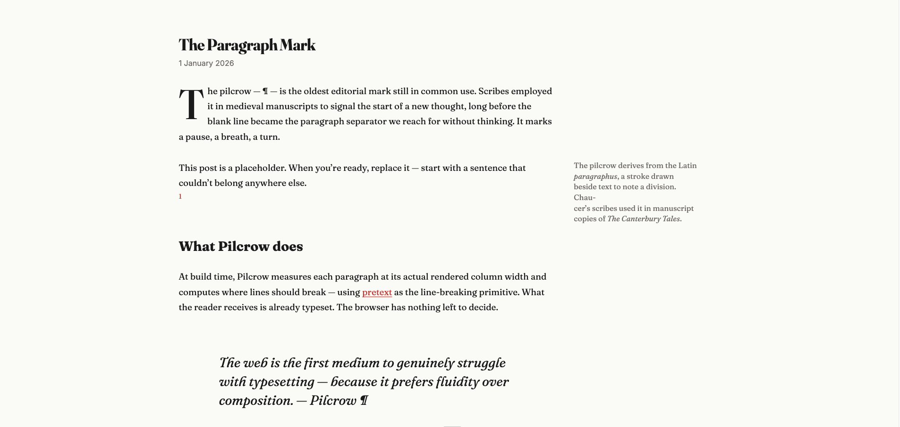

# Pilcrow ¶

*A static blog generator that sets your posts at build time. Markdown in, typeset HTML out. Zero JavaScript at the reader.*



---

Most blog posts on the web today are typeset by accident. The column is as wide as the screen. The line breaks wherever the browser feels like breaking. The font is whatever the operating system happened to ship. None of those decisions were made — they were declined.

Pilcrow makes them. At build time, before the page reaches anyone, Pilcrow measures each paragraph at its actual rendered column width and computes where every line should end. What the reader receives is already set. The browser has nothing left to decide.

## Use Pilcrow with your existing blog

Already running Eleventy or Next.js? You don't need to rebuild your site to typeset it. The same engine that sets pilcrow.page is published as a small set of adapters: an Eleventy plugin, a Next.js rehype plugin, and a standalone library for everything else. Read the [Library](https://pilcrow.page/library/) for install instructions and pick the adapter that matches your stack.

## Built on pretext

The line-breaking is done by [pretext](https://github.com/chenglou/pretext), [@chenglou](https://github.com/chenglou)'s multilingual text-measurement library. Pilcrow adds the editorial layer: drop caps, sidenotes, hyphenation, taste.

## Quick start

```sh
npx create-pilcrow my-blog
cd my-blog
bun install
```

Write a post in `src/content/posts/`. Run `bun run dev` to preview. Run `bun run build` to produce typeset HTML in `dist/`. Push to GitHub and Cloudflare Pages auto-deploys on every commit.

## What you get

Every post is set in Fraunces on a 65-character measure, with a drop cap on the opening paragraph, Tufte-style margin notes via `:::sidenote` directives, footnotes in GFM syntax, pull quotes via `:::pullquote`, and en-gb hyphenation with an orphan guard. The image pipeline converts your photographs to AVIF and WebP at three breakpoints, with thumbhash placeholders baked in at build time. Per-post OG cards are generated in Fraunces during the build. An RSS feed and sitemap come included. None of this requires a line of JavaScript running at the reader.

## Who this is for

Pilcrow is for writers and developers who are comfortable with a terminal and git, and who want their writing set with the same care they'd give a printed page. If you have opinions about measure and line spacing, this is for you.

## Who this isn't for

Pilcrow is not a CMS and will not become one. If you need a visual editor, drag-and-drop layout, or a hosted dashboard, there are better tools. Pilcrow owns the build pipeline — it isn't a plugin you add to an existing WordPress, Webflow, Squarespace, or custom site. A standalone library (pilcrow-typeset) for integrating the typesetting layer into other build pipelines like Next.js or Eleventy is on the roadmap.

## Deploy

Cloudflare Pages is the recommended host: free at meaningful scale, fast globally, and it builds directly from a GitHub repository with no configuration file required on your end. Connect your repo via the [Pages git integration guide](https://developers.cloudflare.com/pages/get-started/git-integration/) and set the build command to `bun run build` and the output directory to `dist`. Vercel, Netlify, and GitHub Pages also work — the output is plain static HTML.

## Documentation

Full documentation at [pilcrow.page](https://pilcrow.page).

## Licence

MIT.

---

*Pilcrow is built on [pretext](https://github.com/chenglou/pretext) by [@chenglou](https://github.com/chenglou). If you ship something with Pilcrow, file an issue to be listed in the directory.*
