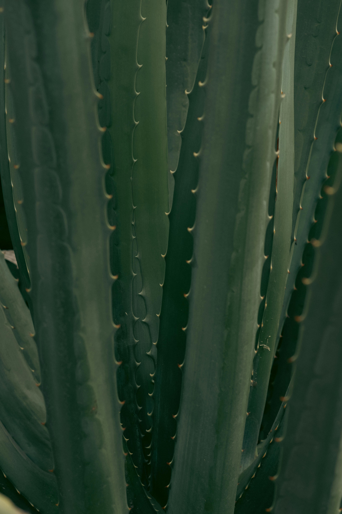
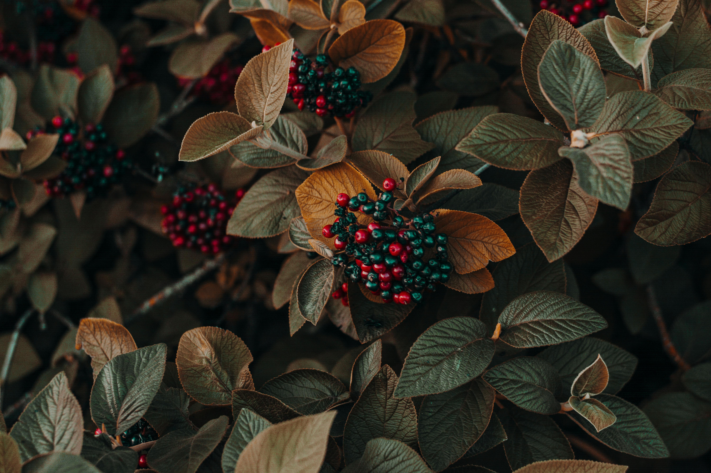
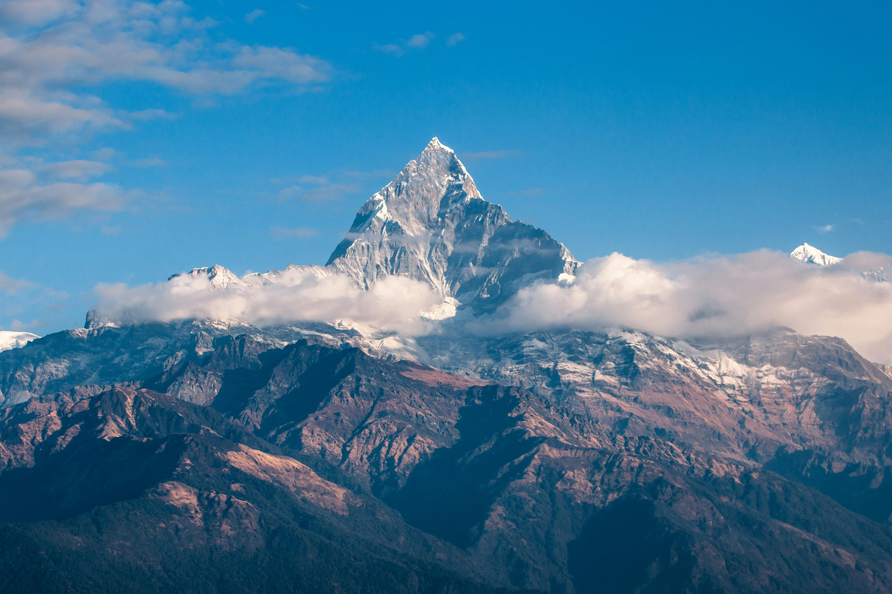

This post exercises Pilcrow's image pipeline: Sharp-generated AVIF, WebP, and fallback variants at 640/1280/1920px; thumbhash placeholders decoded at build time and applied via a small inline script; figcaptions derived from alt text; original-only aspect ratios set inline to prevent layout shift.

The first image is a 3840×5760 JPEG (~1.16 MB) in portrait orientation — the first portrait-ratio source in this test set. The pipeline generates nine output variants (three widths × three formats), clamps to the source width so no upscaling occurs, and encodes a 32px thumbhash thumbnail at build time.

The second image is a 6000×4000 JPEG (~3 MB). All three sources are JPEG — the fallback `` is therefore a JPEG, and the `<picture>` element offers AVIF and WebP srcset entries generated by Sharp at build time.

The third image is a 4872×3248 JPEG (~1.6 MB). All three width variants (640w, 1280w, 1920w) are generated — the source at 4872px exceeds 1920px, so no upscaling occurs at any width.

<!--
Test images sourced from Pexels (Pexels License — free for commercial and personal use, no attribution required):
- pexels-kaiya-inouye-559644190-32554947.jpg by kaiya-inouye (photo ID: 32554947)
- pexels-iriser-1379636.jpg by iriser (photo ID: 1379636)
- pexels-pixabay-417173.jpg by pixabay (photo ID: 417173)
-->
