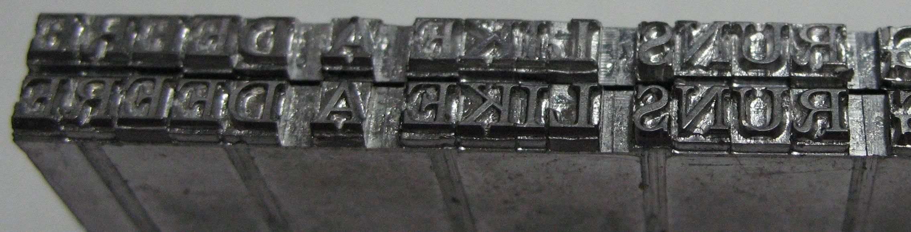

The line break is the oldest unsolved problem in web typography. Every other element of editorial craft — the typeface, the leading, the measure, the weight — can be specified in a stylesheet and trusted to render consistently. The line break cannot. The browser decides where each line ends at the moment the reader opens the page, using a reflow algorithm that knows nothing about the paragraph as a unit, nothing about the rhythm of the sentence, and nothing about what the compositor would have done.

Print never worked this way. In a print shop, the compositor set the type into a forme before the ink touched paper. The line breaks were made decisions, not runtime accidents. A Linotype operator in 1920 was making line-break choices — justified or ragged, with or without hyphenation, hold the widow — that the web has never learned to make at all.

:::sidenote
The Linotype machine, patented in 1884, allowed a single operator to cast complete lines of type in one motion. It replaced a process in which individual letters were hand-set character by character. The line break was baked into the cast slug; it could not change after the fact.
:::

The browser's reflow engine is not unintelligent. It handles bidirectional text, handles Unicode, handles variable-width glyphs with reasonable accuracy. What it cannot do is reason about the paragraph as a whole before committing to a break. It walks the line from left to right, packs in glyphs until the measure is full, and wraps. That is not typesetting. That is triage.

The consequence shows up at 65 characters — the measure where Fraunces sits on this page. At that width, a greedy line-breaker will occasionally produce a very short first line in a paragraph, or strand a two-syllable word alone at the end of a long one. These are not disasters. But they are the kind of small failure that accumulates, paragraph by paragraph, into a page that reads like it was assembled rather than composed.

:::pullquote
Typography exists to honour content.

— Robert Bringhurst
:::

Pilcrow's answer is to move the decision earlier. At build time, before the page reaches anyone, a headless Chromium instance loads each post with its actual CSS — the real Fraunces instance at its real optical size, the real 65ch measure — and runs `pretext`[^1] over every paragraph. The line breaks are computed against the actual rendered geometry, not an approximation of it. The output is a static HTML file with every prose line wrapped in a ``. The browser receives pre-broken text. There is nothing left to decide.

:::sidenote
pretext is a line-breaking primitive by Cheng Lou that measures via Canvas 2D rather than DOM reflow. It is grapheme-aware, multilingual, and fast enough to run against a full post at build time. Pilcrow is the editorial layer built above it; pretext is the load-bearing wall underneath.
:::

The hyphenation works the same way. Hyphenopoly, a TeX-trained library, inserts soft hyphens at syllable boundaries before the typeset pass runs. The combination produces breaks that a browser's `hyphens: auto` cannot: breaks chosen for the particular word at the particular column width, with a four-character minimum on the post-hyphen fragment so the eye is never stranded on a residual like `cs` or `ly` with nothing to anchor it.[^2] Words like *disproportionate* and *comprehension* and *extraordinary* break at the syllable, not wherever the glyph count happened to run out.

The drop cap on this post's first paragraph is not decoration. It is a structural signal — the same signal that rubricators drew in red ink into manuscript codices to mark the start of a new section. It tells the reader: *this is the beginning; the text is waiting for you*. Pilcrow measures the float box created by the cap and adjusts each successive line's available width accordingly, so the text runs alongside it cleanly rather than tucking under. That measurement happens at **build time**. The browser never sees it as a problem to solve.

The argument is not that the web should work like print. Print is print; it has its own constraints and its own failures. The argument is that the line break has always required a person — or, failing a person, a system that reasons about the whole paragraph before committing to a break. The web delegated that to a greedy reflow algorithm and called it good enough. For a long time it was. In 2026, when the default page is assembled in thirty seconds from a template that ten thousand other sites are also using, good enough is no longer distinguishable from not trying.

A typeset page is distinguishable. Not because it shouts — it doesn't — but because it holds still. The column does not drift. The lines end where they should. The face earns its place at this size. The page arrives at the reader already composed, carrying the evidence of a decision made for their sake, before they arrived.

[^1]: `pretext` is `@chenglou/pretext` on npm. It walks the text buffer counting graphemes against a Canvas 2D measurement context, without touching the rendered DOM. Pilcrow routes it through a Playwright `page.route()` intercept at a virtual origin — no network request, version-pinned, fully deterministic across builds.

[^2]: The four-character threshold is Pilcrow's orphan guard. After pretext computes a paragraph's lines, the guard checks every hyphenated line-end. If the post-hyphen fragment on the next line is fewer than four characters, the guard strips the offending soft hyphen and re-runs the layout from the paragraph start. The upstream fix for the root cause — pretext issue #162, filed 2026-04-30, resolved 2026-05-08 in commit `f06fef0` — changes pretext's default behaviour so soft-hyphen breaks stay at the insertion point. When that fix reaches npm, the guard comes out.
